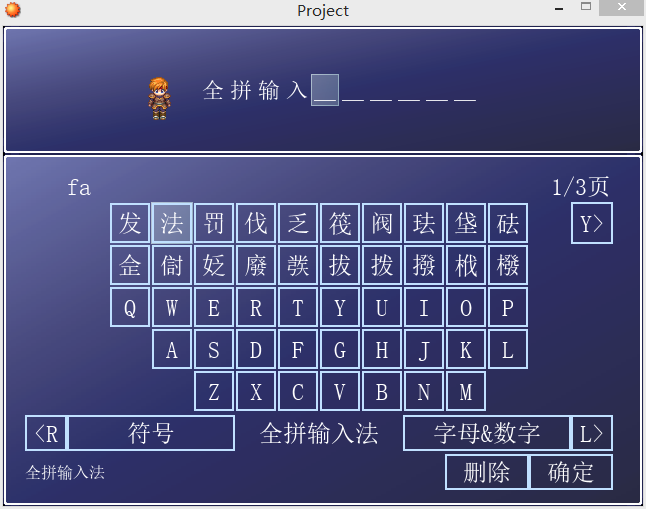
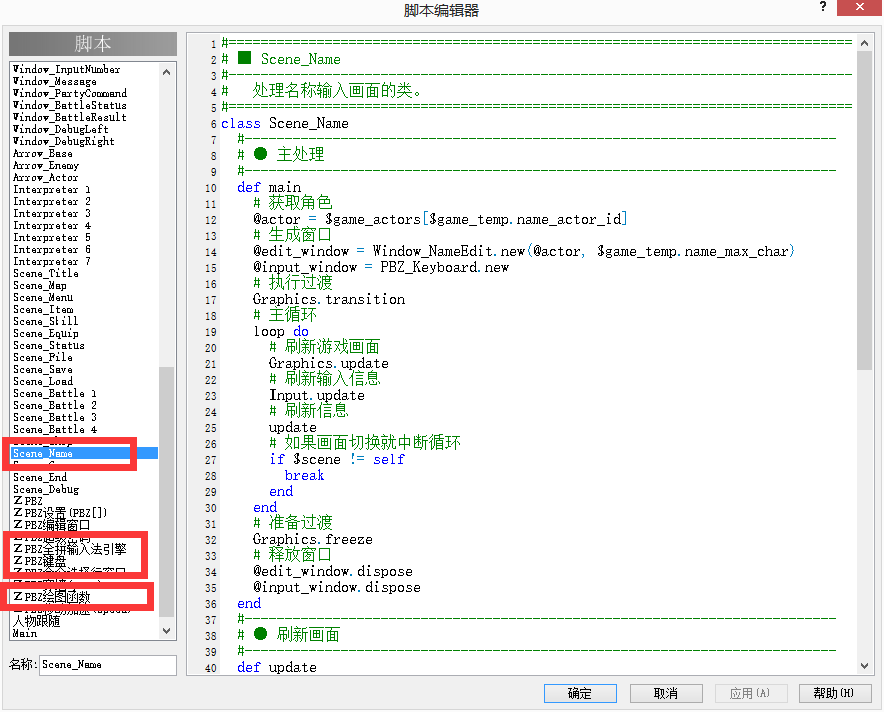

RPG MAKE XP 虚拟键盘
========

截图
--------

  
  

使用说明(要增加或替换的脚本在 src 目录下)
--------

1. 添加三个脚本
   * ＺPBZ全拼输入法引擎
   * ＺPBZ键盘
   * ＺPBZ绘图函数
   **注意**：【ＺPBZ全拼输入法引擎】必须在【ＺPBZ键盘】前面
2. 替换一个脚本
   * Scene_Name

其他说明
--------

具体是在2015年实现的，现在将其在 git 上发布。

开源协议
--------

此代码采用 **MIT** 开源协议发布
